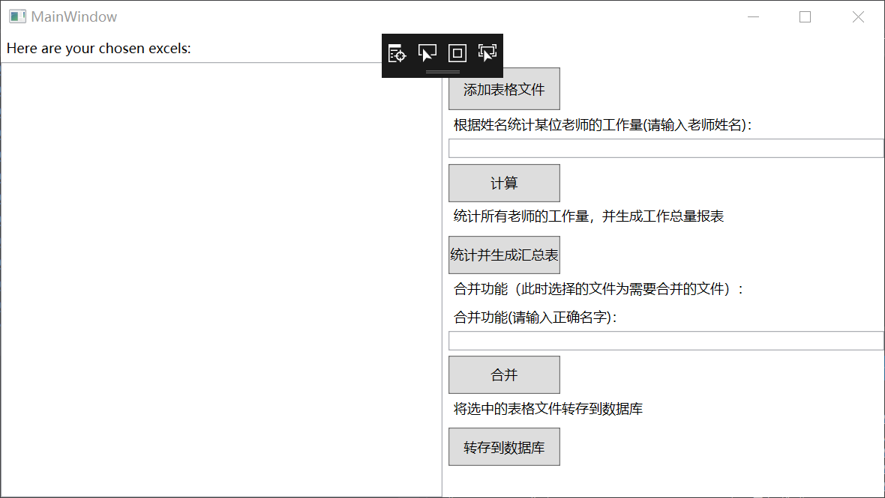

# .NET实验大作业 

 **根据课程工作量统计表，统计所有老师的工作量，并形成报表。**

## 环境
   vs2017

## 需实现功能如下

1. 美观的用户UI  （待完善！）

2. 选择多个EXCEL  

3. 可以根据教师姓名统计某位老师的工作量，并生成新的EXCEL

4. 可以统计所有老师工作量，形成新的EXCEL，并可以生成所有老师的工作总量报表  

5.  实现姓名合并功能，避免有时姓名输入错误  

6. 实现转存到sqlite等数据库（待完善！）

   

## 其它注意事项

- 对于不同的功能所要选择的表格文件不同，请UI设计人员增加相应的提示信息，以便此项目拥有更好的用户体验。
- 本项目中未实现判断选择的表格文件是否与相应功能一致的功能，欢迎完善。

## 示例

